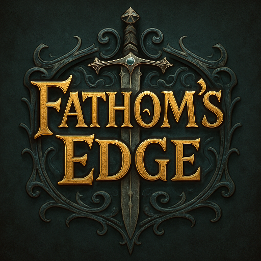

# fathoms-edge

_Fathom's Edge_ is a fantasy role-playing game for [Mini Micro](https://miniscript.org/MiniMicro).  Inspired by [EAMON](https://eamon.wiki/Main_Page), the unusual thing about _Fathom's Edge_ is that it will support adventures written by third-party developers.  You can take your character from the main town (which is named Fathom's Edge), across the magical barrier known as the "Fathom," to any adventure -- and then keep the experience and treasure when you return back to town.  You can even take items from one adventure to another!

## Status

_Fathom's Edge_ is currently at version **0.2**.  See the [road map](roadmap.md) for a concise list of what's done, and what is still to do.

## Progress Reports
- [Progress Report #1](https://dev.to/joestrout/fathoms-edge-progress-report-1-2llb)
- [Progress Report #2](https://dev.to/joestrout/fathoms-edge-progress-report-2-5d8m)

See also the internal [development log](progress.md).

